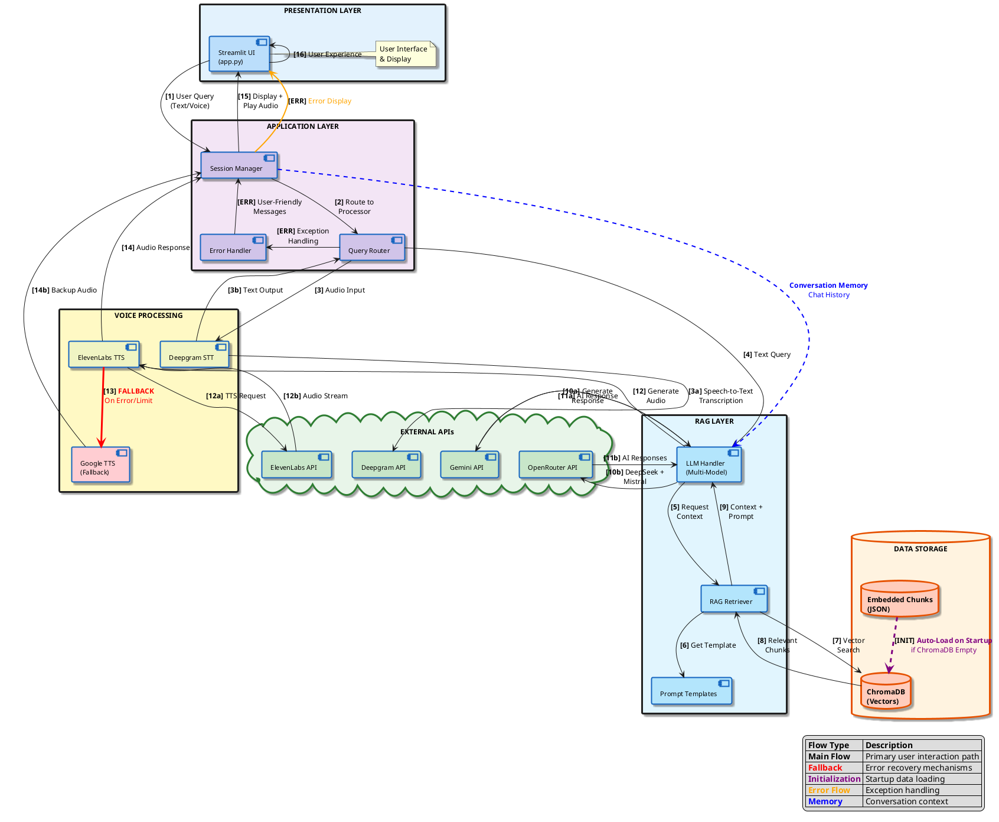

# Virtuans Voice Agent 🎤🤖

A comprehensive **multi-model voice-enabled RAG chatbot** for Sunmarke School that combines:
- **3 Parallel AI Models**: Gemini 2.5 Flash + DeepSeek R1 + Mistral 7B 
- **Voice Input**: Deepgram Speech-to-Text
- **Voice Output**: ElevenLabs Text-to-Speech for each model
- **RAG Knowledge Base**: ChromaDB + Sentence Transformers
- **Real-time Web Interface**: Streamlit with chatbot-style UI

## 🚀 Quick Start

### 1. Environment Setup
```bash
# Clone and navigate to project
cd Voice-Agent

# Install dependencies
pip install -r requirements.txt

# Set up environment variables
cp .env.example .env
# Edit .env with your API keys
```

### 2. Configure API Keys
Create `.env` file with:
```env
# Required API Keys
GOOGLE_API_KEY=your_gemini_api_key_here
OPENROUTER_API_KEY=your_openrouter_key_here
DEEPGRAM_API_KEY=your_deepgram_key_here
ELEVENLABS_API_KEY=your_elevenlabs_key_here

# Optional Configuration
CHROMA_COLLECTION_NAME=sunmarke_content
TARGET_WEBSITE=https://www.sunmarke.com/
```

### 3. Data Ingestion (One-Time Setup)
```bash
# Run complete data pipeline (all steps in one command)
python data_ingestion/run_scraper.py

# This single command runs:
# 1. Scrape website content from sunmarke/ directory
# 2. Chunk content into smaller pieces  
# 3. Generate embeddings using sentence-transformers
# 4. Store in ChromaDB vector database
```

**Pipeline Output:**
- `data/scraped_content/sunmarke_raw.json` - Raw scraped content
- `data/scraped_content/sunmarke_chunks.json` - Processed chunks
- `data/embedded_chunks/sunmarke_embedded.json` - Chunks with embeddings
- `db/chromadb_store/` - ChromaDB vector database

### 4. Launch Application
```bash
streamlit run app.py
```
**Access**: http://localhost:8501

---

## 🏗️ System Architecture

### Enhanced Architecture Flow Diagram



### Component Interactions

1. **User Input**: Voice/text → STT/direct processing
2. **Query Processing**: RAG retrieval + multi-model LLM generation
3. **Response Generation**: Parallel AI models + TTS conversion
4. **Data Pipeline**: HTML → Chunks → Embeddings → Vector DB

---

## 🏗️ Project Architecture

### File Structure
```
Voice-Agent/
├── app.py                          # 🎯 Main Streamlit application
├── requirements.txt                # 📦 Python dependencies
├── config/
│   ├── settings.py                 # ⚙️ Configuration management
│   └── __init__.py
├── data/                           # 📊 Knowledge base storage
│   ├── scraped_content/
│   │   ├── sunmarke_raw.json       # Raw scraped website content
│   │   └── sunmarke_chunks.json    # Processed text chunks
│   └── embedded_chunks/
│       └── sunmarke_embedded.json  # Vector embeddings
├── data_ingestion/                 # 🔄 Data processing pipeline
│   ├── run_scraper.py             # Website scraping orchestrator
│   ├── scraper.py                 # BeautifulSoup web scraper
│   ├── chunker.py                 # Text chunking & preprocessing
│   ├── embeddings.py              # Sentence transformer embeddings
│   ├── processor.py               # Content processing utilities
│   └── html_analyze.py            # HTML structure analysis
├── db/                            # 🗄️ Vector database
│   ├── chroma_manager.py          # ChromaDB operations
│   └── chromadb_store/            # Persistent ChromaDB storage
├── llm/                           # 🧠 LLM integrations (future)
│   └── __init__.py
├── rag/                           # 🔍 RAG core components
│   ├── llm_handler.py            # Multi-model LLM orchestrator
│   ├── prompt_templates.py       # Sunmarke-specific prompts
│   └── retriever.py             # ChromaDB retrieval logic
├── voice_processing/             # 🎤🔊 Speech processing
│   ├── deepgram_stt.py          # Speech-to-Text (Deepgram)
│   └── tts.py                   # Text-to-Speech (ElevenLabs)
├── utils/                       # 🛠️ Helper utilities
│   ├── helpers.py              # General utility functions
│   └── logger.py               # Logging configuration
└── sunmarke/                   # 📁 Scraped website content
    └── [website structure]
```

---

## 🔧 Core Components

### Multi-Model LLM Handler (`rag/llm_handler.py`)
- **Models**: Gemini 2.5 Flash, DeepSeek R1 Chimera, Mistral 7B Instruct
- **Memory**: Shared conversation history across all models
- **Execution**: Async parallel responses with individual timing
- **Prompts**: Sunmarke-specific guidelines from `prompt_templates.py`

```python
# Example usage
llm_handler = LLMHandler(gemini_key, openrouter_key)
multi_results = await llm_handler.generate_multi_model_answers(
    query="What are the admission requirements?", 
    context_docs=retrieved_documents
)
```

### Voice Processing
**Speech-to-Text** (`voice_processing/deepgram_stt.py`):
- Deepgram Nova-2 model for transcription
- Hash-based duplicate audio prevention
- Real-time audio processing with Streamlit recorder

**Text-to-Speech** (`voice_processing/tts.py`):
- ElevenLabs API with Rachel voice
- Individual audio generation per model response
- MP3 format for web playback

### RAG System (`rag/retriever.py`)
- **Vector DB**: ChromaDB with persistent storage
- **Embeddings**: Sentence Transformers `all-MiniLM-L6-v2`
- **Retrieval**: Configurable top-k document retrieval
- **Context**: Automatic relevance scoring and source citations

---

## 📊 Data Ingestion Pipeline

The system processes Sunmarke School's website content through an automated 4-stage pipeline executed by a single command:

### Single Command Execution
```bash
python data_ingestion/run_scraper.py
```

This command automatically runs all four stages:

### Stage 1: Web Content Extraction
- **Input**: HTML files from `sunmarke/` directory (pre-scraped website)
- **Process**: BeautifulSoup parsing, content extraction, text cleaning
- **Output**: `data/scraped_content/sunmarke_raw.json`
- **Component**: `data_ingestion/scraper.py`

### Stage 2: Content Chunking
- **Input**: Raw scraped content JSON
- **Process**: Text chunking (1200 chars, 200 overlap), metadata preservation
- **Output**: `data/scraped_content/sunmarke_chunks.json`
- **Component**: `data_ingestion/chunker.py`

### Stage 3: Vector Embedding Generation
- **Input**: Processed text chunks
- **Process**: Sentence transformer encoding (all-MiniLM-L6-v2)
- **Output**: `data/embedded_chunks/sunmarke_embedded.json`
- **Component**: Integrated in `run_scraper.py`

### Stage 4: ChromaDB Storage
- **Input**: Embedded chunks
- **Process**: Vector database storage, metadata indexing
- **Output**: `db/chromadb_store/` (persistent vector database)
- **Component**: `db/chroma_manager.py`

**Pipeline Time**: ~2-5 minutes depending on content size

---

## 🎮 User Interface

### Streamlit Web App (`app.py`)
- **Layout**: Chatbot-style with bottom input area
- **Multi-Model Display**: 3-column layout showing parallel responses
- **Voice Input**: Record button next to text input
- **Audio Playback**: Individual TTS buttons for each model response
- **Features**: Response timing, source citations, conversation memory

### Key UI Components:
1. **Chat History**: Scrollable message history with role-based styling
2. **Multi-Model Responses**: Side-by-side comparison of 3 AI models
3. **Voice Interface**: 🎤 Record → 📝 Transcribe → 📤 Send workflow
4. **Settings Sidebar**: Top-k retrieval, clear chat, message counter

---

## 🔑 Configuration

### Environment Variables (`.env`)
```env
# Core API Keys (Required)
GOOGLE_API_KEY=your_gemini_api_key
OPENROUTER_API_KEY=your_openrouter_key  # For DeepSeek + Mistral
DEEPGRAM_API_KEY=your_deepgram_key
ELEVENLABS_API_KEY=your_elevenlabs_key

# Database Configuration
CHROMA_PERSIST_DIRECTORY=./db/chromadb_store
CHROMA_COLLECTION_NAME=sunmarke_content

# Scraping Configuration
TARGET_WEBSITE=https://www.sunmarke.com/
MAX_PAGES=100

# RAG Configuration
# RAG Configuration
CHUNK_SIZE=1000
CHUNK_OVERLAP=200
TOP_K_RESULTS=5
```

### Settings Class (`config/settings.py`)
Pydantic-based configuration management with environment variable support.

---

## 📋 Dependencies

### Core Libraries:
- **streamlit**: Web interface framework
- **langchain + langchain-classic**: LLM orchestration & RAG chains
- **chromadb**: Vector database for embeddings
- **sentence-transformers**: Text embedding generation
- **google-generativeai**: Gemini AI integration
- **openai**: OpenRouter API client (DeepSeek, Mistral)

### Voice Processing:
- **deepgram-sdk**: Speech-to-text transcription
- **elevenlabs**: Text-to-speech synthesis  
- **audio-recorder-streamlit**: Web audio recording (v0.0.8 - stable)

### Data Processing:
- **beautifulsoup4**: HTML parsing and web scraping
- **pandas**: Data manipulation and processing
- **requests**: HTTP client for web scraping

**Full requirements**: See [requirements.txt](requirements.txt)

---

## 🔄 Workflow

### Typical User Session:
1. **Launch App**: `streamlit run app.py`
2. **Voice Input**: Click 🎤 Record → Speak question → Auto-transcribe
3. **Multi-Model Response**: Get parallel answers from 3 AI models
4. **Audio Playback**: Click 🔊 Play Audio for any model's response
5. **Follow-up**: Continue conversation with shared memory

### System Flow:
```
User Question → Voice/Text Input → RAG Retrieval → Multi-Model LLMs → TTS → Display
     ↑                                   ↓
Conversation Memory ←← Context + Sources + Timing + Audio
```

---

## 🛠️ Development

### Recent Improvements (January 2026):
- **Stability Fix**: Downgraded `audio-recorder-streamlit` from v0.0.10 to v0.0.8
- **Issue Resolved**: Fixed "Failed to fetch dynamically imported module" error on Render deployments
- **Performance**: Enhanced cloud deployment compatibility for voice processing

### Adding New Models:
1. Add model initialization in `rag/llm_handler.py`
2. Update `generate_multi_model_answers()` async execution
3. Modify UI layout in `app.py` for additional columns

### Extending Data Sources:
1. Update `TARGET_WEBSITE` in config
2. Run data ingestion pipeline
3. ChromaDB automatically handles new embeddings

### Custom Prompts:
Edit `rag/prompt_templates.py` for domain-specific instructions.

---

## 📖 API Keys Setup

### Required Services:
1. **Google AI Studio**: https://aistudio.google.com/ (Free Gemini API)
2. **OpenRouter**: https://openrouter.ai/ (DeepSeek + Mistral free tier)
3. **Deepgram**: https://console.deepgram.com/ (STT with free credits)
4. **ElevenLabs**: https://elevenlabs.io/ (TTS with free tier)

### Free Tier Limits:
- **Gemini**: 15 requests/minute
- **DeepSeek/Mistral**: Free with OpenRouter credits
- **Deepgram**: $200 free credits
- **ElevenLabs**: 10,000 characters/month free

---

## 🎯 Features

### ✅ Implemented:
- [x] Multi-model parallel AI responses (3 models)
- [x] Shared conversation memory across models
- [x] Real-time voice input (Deepgram STT)
- [x] Individual TTS audio for each model
- [x] RAG with ChromaDB vector search
- [x] Response timing display
- [x] Chatbot-style UI with bottom input
- [x] Source citation with relevance scores
- [x] Automated data ingestion pipeline
- [x] Persistent conversation history


---

## 🐛 Troubleshooting

### Common Issues:

**"No module named 'langchain_classic'"**
```bash
pip install langchain-classic
```

**ChromaDB permission errors**
```bash
# Delete and recreate database
rm -rf db/chromadb_store/
python data_ingestion/embeddings.py
```

**Audio recording not working**
- Check browser microphone permissions
- Try refreshing the page
- Ensure HTTPS if deployed (required for audio)
- **Fixed**: Updated to audio-recorder-streamlit v0.0.8 for better cloud compatibility

**API rate limits**
- Gemini: Wait 1 minute between requests
- Use OpenRouter dashboard to monitor usage
- Consider upgrading to paid tiers for production

---

## 📞 Support

For issues or questions:
1. Check the logs in terminal output
2. Verify API keys in `.env` file
3. Review the troubleshooting section above
4. Check component-specific error messages in the UI

---

**Virtuans Voice Agent - Sunmarke School AI Assistant**

*Last Updated: January 2026*
